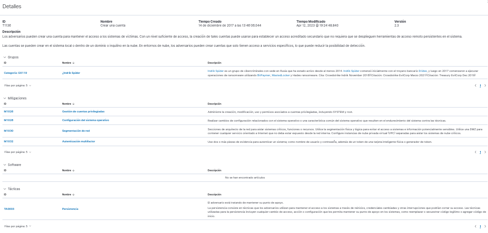

# 🛡️ INC-20260929-001 — Detección de Creación de Cuenta (T1136)


## 📋 Resumen del Incidente

| Campo | Valor |
|-------|-------|
| **ID** | INC-20260929-001 |
| **Fecha de Detección** | 2026-09-29 14:00 UTC |
| **Fecha de Cierre** | 2026-09-29 14:15 UTC |
| **Analista** | Jaq |
| **Clasificación** | Verdadero Positivo Benigno |
| **Severidad** | Baja |
| **Técnica MITRE** | [T1136 — Create Account](https://attack.mitre.org/techniques/T1136/) |
| **Regla Wazuh** | 5902 — New user added to the system (Nivel 8) |

---

## 🎯 Objetivo del Ejercicio

Validar la capacidad de detección del SIEM **Wazuh** frente a la creación de cuentas de usuario locales (Técnica **T1136** de MITRE ATT&CK). Esta técnica es comúnmente utilizada por atacantes para establecer **persistencia** en un sistema comprometido.

**Entorno del laboratorio:**
- **SIEM:** Wazuh (Ubuntu Server) — `siem-server` (192.168.1.10)
- **Endpoint:** EndeavourOS (Arch Linux) — `endpoint-lab` (192.168.1.20)
- **Conexión:** SSH desde el endpoint hacia el servidor SIEM.

---

## 🚨 Detección

La alerta fue generada por el agente de Wazuh instalado en el endpoint y visualizada en el dashboard del servidor SIEM.

### Descripción de la regla T1136


### Dashboard MITRE ATT&CK



*Nota: La columna `agent.name` ha sido sanitizada para proteger la identidad del endpoint.*

**Detalles de la alerta:**
- **Regla:** 5902
- **Descripción:** New user added to the system.
- **Nivel:** 8
- **Táctica:** Persistence (TA0003)
- **Técnica:** T1136 (Create Account)

---

## 🔍 Investigación y Evidencia

Una vez recibida la alerta, se procedió a investigar en el **endpoint** (no en el servidor SIEM), ya que es allí donde ocurrió la acción.

### 1. Verificación de la existencia del usuario

```bash
$ grep testuser /etc/passwd
testuser:x:1001:1001::/home/testuser:/usr/bin/bash
```

### 2. Revisión de logs de autenticación

```bash
$ journalctl --since "1 hour ago" | grep -i "testuser\|useradd"
sep 29 14:00:20 endpoint-lab sudo[5407]:   Jaq : TTY=pts/1 ; PWD=/home/Jaq ; USER=root ; COMMAND=/usr/bin/useradd -m testuser
sep 29 14:00:21 endpoint-lab useradd[5410]: new group: name=testuser, GID=1001
sep 29 14:00:21 endpoint-lab useradd[5410]: new user: name=testuser, UID=1001, GID=1001, home=/home/testuser, shell=/usr/bin/bash, from=/dev/pts/2
```

### 3. Verificación del directorio home

```bash
$ ls -la /home/testuser
ls: cannot open directory '/home/testuser': Permission denied
```

---

## 🧠 Hipótesis evaluadas

- **Creación maliciosa de usuario (Descartada):** Los logs muestran que el usuario fue creado por `Jaq` mediante `sudo`, no por un actor externo. La IP de origen es local (terminal SSH).
- **Error de configuración (Descartada):** No hubo scripts automáticos ni tareas programadas (cron) que crearan el usuario.
- **Prueba controlada (Confirmada):** La acción fue intencionada para validar la regla T1136 de Wazuh.

### Razonamiento

Wazuh detectó correctamente un cambio en `/etc/passwd`. Aunque la técnica T1136 es utilizada por atacantes para persistencia, el contexto (usuario `testuser`, ejecución manual por `Jaq`, horario de laboratorio) indica actividad legítima. La inteligencia de amenazas de Wazuh (que menciona grupos como "Indrik Spider") es contextual y no aplica a este caso.

---

## ✅ Acciones Tomadas

- [x] Verificación de logs en el endpoint (`journalctl`).
- [x] Confirmación de actividad autorizada.
- [x] Eliminación del usuario: `sudo userdel -r testuser`.
- [x] Verificación de eliminación: `grep testuser /etc/passwd` (sin resultados).
- [x] Documentación del incidente.

---

## 📎 Anexos

- Captura de la regla T1136 (sanitizada)
- Captura del Dashboard MITRE ATT&CK (sanitizada)
- Informe completo del incidente (INC-20260929-001.md)

## 🔗 Referencias

- [MITRE ATT&CK T1136 — Create Account](https://attack.mitre.org/techniques/T1136/)
- [Wazuh Documentation — Ruleset](https://documentation.wazuh.com/)
- Home SOC Lab — Repositorio Principal

---
*Informe elaborado como parte del Home SOC Lab. Datos personales sanitizados según la política del repositorio.*